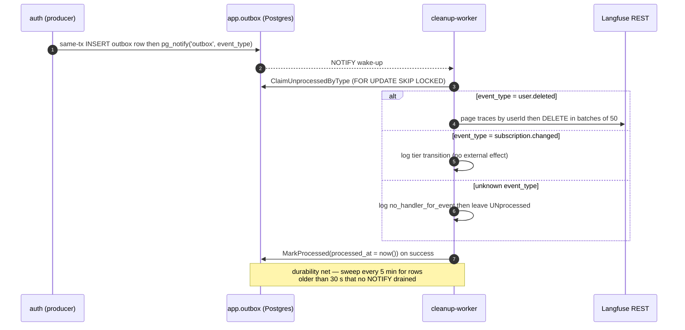

# cleanup-worker

A small Go binary that implements a **transactional-outbox + choreography** consumer. Producers — the `auth` service and a trigger on `auth.users` — `INSERT` rows into `app.outbox` inside their own business transaction; this worker `LISTEN`s on the Postgres `outbox` notify channel for a push wake-up and runs a periodic `SELECT … FOR UPDATE SKIP LOCKED` sweep as a durability net, then executes side-effects and stamps `processed_at`. **Postgres is the message bus** — no Kafka, no RabbitMQ. Today it does GDPR cleanup (purge a deleted user's Langfuse traces) and telemetry (log subscription transitions), plus three wall-clock retention/TTL crons that DELETE rows directly.

## Layout

```
modules/services/cleanup-worker/
├── cmd/cleanup-worker/main.go            boot: pool, registry, worker, crons, /healthz + /metrics
├── internal/worker/worker.go             LISTEN + sweep loop, dispatchAndCommit
├── internal/db/outbox.go                 ClaimUnprocessedByType / ClaimUnprocessedSweep / MarkProcessed
├── internal/db/pool.go                   pgxpool + dedicated LISTEN conn, AssertSchemaReady
├── internal/handlers/registry.go         event_type → []Handler
├── internal/handlers/user_deleted.go     user.deleted → Langfuse trace purge
├── internal/handlers/subscription_changed.go  subscription.changed → log only
├── internal/handlers/retention.go        prune processed app.outbox + auth.rc_webhook_events
├── internal/cron/{anon_cleanup,signed_in_ttl}.go  idle-account TTL crons
├── internal/observability/langfuse_purge.go   Langfuse REST trace deletion
├── internal/observability/outbox_metrics.go    pending-age gauge poller
├── internal/config/config.go             env-driven Config
├── Dockerfile                            golang:1.25-alpine → FROM scratch (~10 MB)
└── README.md
```

Producer side lives in `infra/app/db/migrations/0023_outbox.up.sql` (+ `0026_outbox_dedup.up.sql`) and `modules/services/auth/internal/service/subscription.go`. Compose service `cleanup-worker` (profile `[origin]`).

## The outbox event model

`app.outbox` (schema `app`):

| Column | Notes |
|---|---|
| `id bigserial` | PK. |
| `event_type text` | Dotted name, e.g. `user.deleted`. |
| `aggregate_id text` | Stringified id (both current events: `auth.users.id`). |
| `payload jsonb` | Event body. |
| `occurred_at timestamptz` | Stamped at INSERT ("stuck since when"). |
| `processed_at timestamptz` | NULL = unprocessed; worker sets it on success. |
| `source_event_id text` | Producer dedup key (nullable). |

Two partial indexes: `… (event_type, occurred_at) WHERE processed_at IS NULL` (cheap next-unprocessed lookup) and a unique `… (event_type, source_event_id) WHERE source_event_id IS NOT NULL` (producer dedup).



**Producers (same-tx INSERT):**

- `user.deleted` — an `AFTER DELETE` trigger on `auth.users`. `app.emit_user_deleted()` (SECURITY DEFINER) inserts the row and `PERFORM pg_notify('outbox', 'user.deleted')`. The NOTIFY payload is just the event-type string — a wake-up filter, not the source of truth.
- `subscription.changed` — emitted by the auth RC-webhook path, in the same tx as `rc_webhook_events` MarkProcessed, payload `{tier, tier_expires_at, rc_app_user_id}`, deduped on `(event_type, source_event_id = RC eventID)`.

**Claiming:** two paths, both `FOR UPDATE SKIP LOCKED`. The push path (`ClaimUnprocessedByType`) is triggered by a NOTIFY; the durability sweep (`ClaimUnprocessedSweep`) claims rows `older than 30 s` on a 5-minute ticker (the 30 s floor avoids racing the producer's NOTIFY). Batch size 100, oldest-first; on boot the worker does one immediate sweep before starting the listener.

**Retries:** infinite, no dead-letter table — events are never dropped. A handler error logs `handler_failed` and skips the `MarkProcessed` for that row, so it reappears on the next sweep. **Handlers must be idempotent** (a crash between the side-effect and the UPDATE replays the row). An **unknown event_type is deliberately not stamped** — it loops forever, loud-by-design, surfaced by the pending-age alert.

## Handlers

`worker.dispatchAndCommit` looks up `Registry.HandlersFor(evt.EventType)` and runs each in order, short-circuiting on the first error.

- **`user.deleted` → `UserDeleted`** — calls `LangfuseClient.PurgeUserTraces(aggregateID)`: pages `GET /api/public/traces?userId=…` (≤ 200 pages × 100 = 20 000 traces) then `DELETE /api/public/traces` in batches of 50, HTTP basic-auth, 15 s timeout. If `LANGFUSE_HOST` is unset it is a logged no-op. It does **not** touch RevenueCat — there is no RC-deletion handler.
- **`subscription.changed` → `SubscriptionChanged`** — logs `subscription_changed {user_id, tier}` and nothing else. Redis rate-limit keys are intentionally **not** cleared on downgrade (anti-abuse); the row exists for future fan-out.

## Crons (direct DELETEs, same process)

Three wall-clock loops run alongside the outbox consumer:

- **Anon-account cleanup** — deletes idle anonymous accounts past `CLEANUP_ANON_TTL` (default 365 d).
- **Signed-in TTL** — long-tail cleanup of idle signed-in accounts past `CLEANUP_SIGNED_IN_TTL` (~24 mo), **dry-run by default** (logs would-delete ids until flipped). Activity proxy for both is `refresh_tokens.created_at`, not `expires_at`.
- **Retention sweep** — prunes processed `app.outbox` (30 d) and `auth.rc_webhook_events` (90 d) rows.

## Observability

- **Prometheus gauge** `shruti_outbox_pending_seconds{event_type}` = max age of unprocessed rows per type, refreshed every 30 s and `Reset()` each poll so a drained type stops reporting. A Grafana alert (`outbox_dead_letter`) fires off this gauge → Telegram when a type stays stuck. Exposed on `/metrics` alongside `/healthz`.
- **Structured JSON slog** lines: `event_processed`, `no_handler_for_event`, `handler_failed`, `langfuse_purge_done`/`_no_traces`/`_skipped_unconfigured`, `subscription_changed`, `anon_cleanup_deleted_user`, `retention_sweep_done`, etc. — every line tagged `ENV` + `SERVICE_VERSION`.

## Configuration

| Var | Default | Purpose |
|---|---|---|
| `DATABASE_URL` | required | Postgres DSN. |
| `CLEANUP_SWEEP_INTERVAL` | `5m` | Durability-net sweep cadence. |
| `CLEANUP_ANON_TTL` / `CLEANUP_ANON_INTERVAL` | `8760h` / `24h` | Anon idle TTL + tick (`0` disables). |
| `CLEANUP_SIGNED_IN_TTL` / `CLEANUP_SIGNED_IN_INTERVAL` | `17520h` / `24h` | Signed-in idle TTL + tick. |
| `CLEANUP_SIGNED_IN_DRY_RUN` | `true` | Log-only until flipped. |
| `CLEANUP_RETENTION_INTERVAL` | `24h` | Retention sweep cadence. |
| `CLEANUP_RETENTION_RC_WEBHOOK_TTL` | `2160h` (90d) | Prune processed `auth.rc_webhook_events`. |
| `CLEANUP_RETENTION_OUTBOX_TTL` | `720h` (30d) | Prune processed `app.outbox`. |
| `PORT` | `8090` | `/healthz` + `/metrics`. |
| `LANGFUSE_HOST` / `LANGFUSE_PUBLIC_KEY` / `LANGFUSE_SECRET_KEY` | — | REST creds; empty host → purge no-op. |

## Deployment

Multi-stage Go 1.25-alpine → `FROM scratch` (~10 MB), CA roots copied in for Langfuse TLS, `ENTRYPOINT ["/cleanup-worker"]`. Image `ghcr.io/jiva-studio/shruti-cleanup-worker:${TAG:-latest}`, profile `[origin]` (it consumes events only auth+chat emit). `depends_on`: `postgres` healthy + `migrator` completed. Scratch image → the healthcheck self-GETs via `["CMD", "/cleanup-worker", "healthz"]`. There is **no inbound API** beyond `/healthz` + `/metrics`. Graceful shutdown drains in-flight handlers/crons (10 s bound).

## Constraints worth remembering

- **Idempotent handlers are mandatory** — a row can replay after a crash between side-effect and stamp.
- **Unknown event types loop forever by design** — add a handler (and a Grafana panel) rather than letting one accumulate.
- **No dead-letter** — a permanently failing handler keeps the row unprocessed and the pending-age alert firing; fix the handler.
- **`user.deleted` purges Langfuse only** — it is not the place to delete RevenueCat or S3 data; those need their own handlers (the table is built to fan out).
