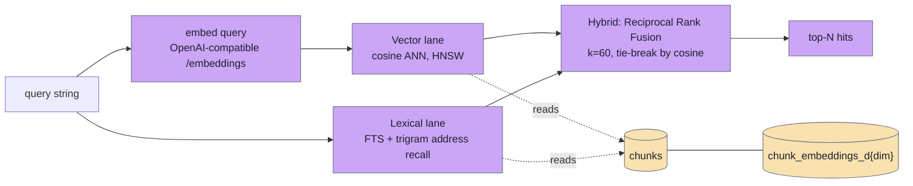

# search-mcp (shruti-search)

A **read-only** Go MCP server over the production Postgres + pgvector corpus. It exists for one job: **curating library attributions**. A curator (or an agent) finds the chunks that back a topic, a user question, or a story, verifies their text, and feeds the returned ids into [shruti-mcp](../runbooks/shruti-mcp.md)'s `library.attribution.*` write tools (see also the [attribution lookup](../architecture/attribution.md) page). It searches the **chat service's own index** — the `chunks` table joined to per-dimension `chunk_embeddings_d<dim>` tables — so a hit here is the same chunk the chat pipeline would retrieve. It never writes.

## Layout

```
modules/services/search-mcp/
├── cmd/search-mcp/main.go          boot: config, pgxpool, HTTP MCP (/mcp + /sse), /healthz, self-probe
├── internal/mcp/tools.go           registers search / search_get / search_window
├── internal/search/search.go       Vector / Lexical / Hybrid (RRF) queries + ByItemID / Window
├── internal/embed/embed.go         one-shot query embedding (OpenAI-compatible /embeddings)
├── internal/store/store.go         read-only pgx access
├── internal/pgvector/vec.go        bind a query vector as a pgvector literal
├── internal/config/config.go       env-driven Config (DB, embed provider/model/dim)
├── internal/envelope/envelope.go   {ok,kind,result} / {ok,kind,error} response envelope
├── Dockerfile                      golang:1.25-alpine → FROM scratch (~15 MB)
└── README.md
```

Compose service `search-mcp` (profile `[origin]`), published **only on the host's Tailscale IP** — there is no Caddy route and no public exposure.

## MCP tools

All three return the standard envelope. The exposed tool names are `search`, `search_get`, `search_window` (the client sees them namespaced as `mcp__shruti-search__*`).

### `search`

Semantic + lexical search over the corpus.

| Param | Default | Notes |
|---|---|---|
| `query` | required | Natural-language query. |
| `scope` | `all` | `transcript` \| `library` \| `all`. |
| `lang` | (any) | ISO-639-1 restriction (e.g. `ru`, `en`). |
| `mode` | `hybrid` | `hybrid` \| `vector` \| `lexical`. |
| `limit` | `10` | Clamped to max 50. |

Returns `{scope, mode, count, hits: [...]}`. `lexical` skips embedding; `vector`/`hybrid` embed the query first.

### `search_get`

Fetch the full text of a source to verify before attributing. Takes `item_id` (all chunks/segments of a library document or verse) **or** `chunk_id` (a single chunk), optional `lang` with `item_id`. Returns `{count, chunks: [...]}`, or `not_found` when empty.

### `search_window`

Transcript chunks of one lecture overlapping a time range — the same window chat uses to resolve a `ref_kind=track` fragment. Takes `track_id` (required), `start_ms` + `end_ms` (required, `end_ms >= start_ms`), optional `pad_ms` (widen each side), `lang`, `limit`. Returns `{count, chunks: [...]}`.

**Hit shape**: `chunk_id`, `kind`, `score`, `lang`, `text`, plus nullable `item_id`, `track_id`, `source_id`, `tokens`, `author_id`, `addr_label`, `start_ms`, `end_ms`. Which ids are non-null tells a library chunk from a transcript chunk.

## Data model and addressing



- **Tables**: `chunks c` (columns include `kind, lang, text, item_id, track_id, source_id, tokens, author_id, addr_label, start_ms, end_ms, segment_index, embed_model`) joined to `chunk_embeddings_d<dim> e ON e.chunk_id = c.id`. Every query filters `c.embed_model = $active` so it only touches vectors from the matching embedder.
- **scope → `chunk.kind`**: `transcript` → `{track_transcript}`; `library` → `{verse, commentary, prose_chapter, letter, title}`; `all` → no filter.
- **Vector lane**: cosine ANN `ORDER BY e.embedding <=> $vec::vector LIMIT n`, score `1 - distance`, inside a txn that sets `hnsw.iterative_scan = relaxed_order` and `hnsw.ef_search = 80` so filtered queries return rows past the default candidate set.
- **Lexical lane**: FTS (`websearch_to_tsquery` over a russian/simple `tsvector`) OR trigram address recall on `addr_label || source_id || tokens` (`pg_trgm` threshold 0.3) — but always carries the **true cosine** as `score` via an inner join to the embeddings.
- **Hybrid**: fuses the two lanes by Reciprocal Rank Fusion (`Σ 1/(k+rank)`, `k=60`), ties broken by cosine.

**Attribution mapping** — from a hit's `kind` to a `library.attribution.ref_add`:

| hit `kind` | attribute as | with |
|---|---|---|
| `verse` | `ref_kind=verse` | `item_id` (or `source_id` + `tokens`) |
| `commentary` / `prose_chapter` / `letter` | `ref_kind=document` | `document_id = item_id` |
| `title` | `ref_kind=title` | `source_id` + `tokens` |
| `track_transcript` | `ref_kind=track` | `track_id` + `start_ms` + `end_ms` |

A lecture is always attributed as a **fragment** `<track_id>@<start_ms>-<end_ms>`, never the whole lecture (one lecture spans many topics).

## How it is reached

Transport is **streamable HTTP MCP** at `/mcp` (stateless), plus a legacy SSE pair `/sse` + `/message`, and `/healthz`. The binary listens on `0.0.0.0:8086` inside the container, but compose publishes the port **only on the Tailscale IP** (`${SHRUTI_TS_IP}:8086:8086`). Clients reach it over the tailnet:

```json
{ "shruti-search": { "type": "http", "url": "http://shruti-prod-eu:8086/mcp" } }
```

There is no token auth on the MCP itself — the security boundary is the tailnet (the public NIC is firewalled, no Caddy route).

## Configuration

| Var | Default | Notes |
|---|---|---|
| `DATABASE_URL` | required | pgvector DSN (the prod `shruti` DB). |
| `SEARCH_MCP_ADDR` | `0.0.0.0:8086` | In-container listen address. |
| `EMBED_PROVIDER` | `openrouter` | `openrouter` \| `openai`. |
| `EMBED_MODEL` | `openai/text-embedding-3-small` | **Must match the chat indexer.** |
| `EMBED_DIM` | `1536` | Selects `chunk_embeddings_d<dim>`; validated against `{256,768,1024,1536}`. |
| `EMBED_QUERY_PREFIX` | (empty) | For e5-family models. |
| `EMBED_BASE_URL` | (empty) | Override the OpenAI-compatible upstream. |
| `OPENROUTER_API_KEY` / `OPENAI_API_KEY` | — | One required, per provider. |

> **Critical invariant:** the `EMBED_*` settings MUST equal the chat indexer's. A mismatch puts query vectors in a different space than the indexed chunks and retrieval silently degrades. It reuses the same `OPENROUTER_API_KEY` as chat.

## Deployment

Multi-stage `golang:1.25-alpine` → `FROM scratch` (~15 MB), static `CGO_ENABLED=0`, CA roots copied in for TLS to the embeddings provider, build SHA/time injected via `-ldflags`. Image `ghcr.io/jiva-studio/shruti-search-mcp:${SHRUTI_SEARCH_MCP_TAG:-latest}`, profile `[origin]`, on the `shruti` docker network so it can reach `postgres:5432`. Because the scratch image has no shell, the healthcheck self-probes: `["CMD", "/search-mcp", "-healthcheck"]`. Watchtower-enabled.

## Constraints worth remembering

- **Read-only** — it never writes; all curation writes go through shruti-mcp's `library.attribution.*` against `catalog/current.db`.
- **Tailnet-only** — not reachable from the public internet; you need to be on the tailnet (`shruti-prod-eu`).
- **Embedder must match chat** — otherwise results look plausible but are quietly wrong.
- **Hits are fragments** — always attribute a lecture by `track_id@start-end`, never whole.
