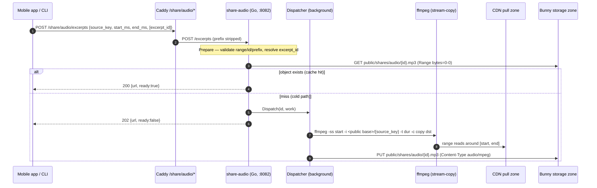
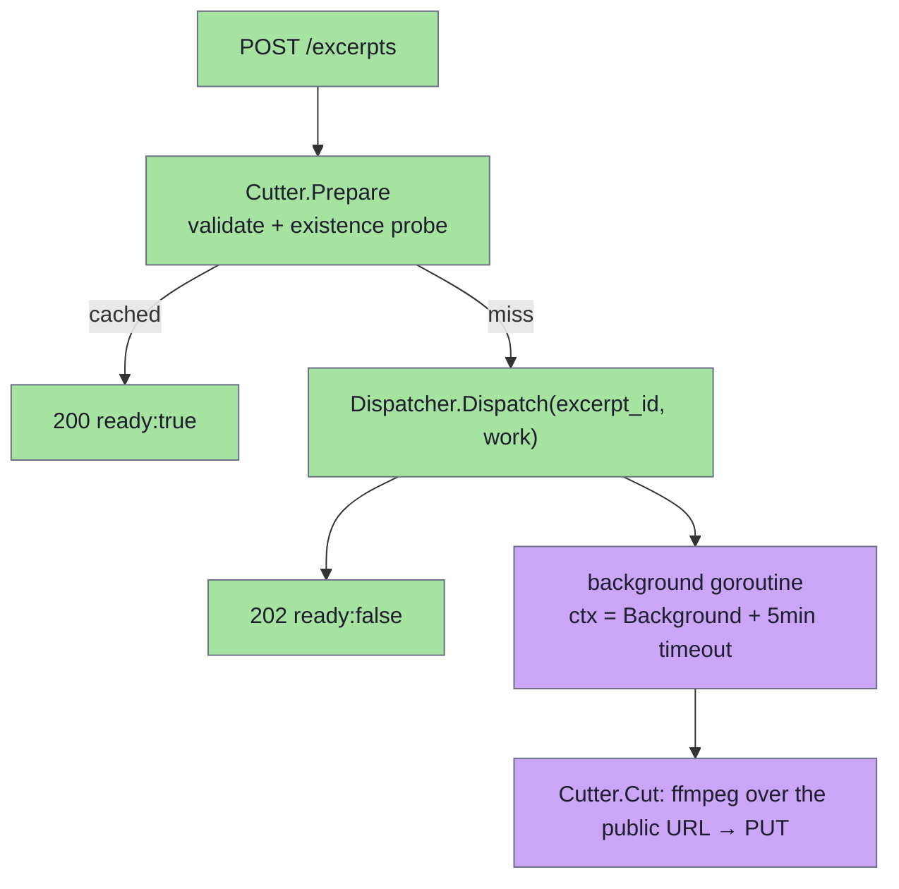
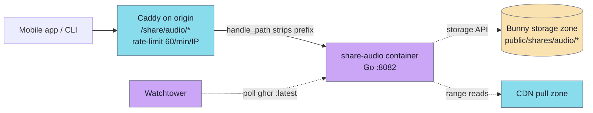

# share-audio

A small Go HTTP service that cuts a fragment out of a published MP3 and uploads the result as a public excerpt under `public/shares/audio/{id}.mp3` in the Bunny storage zone, the one write store. It runs as a container in the origin app stack (`infra/app/compose`) behind Caddy at `/share/audio/`, not as a serverless function. A `POST /excerpts` with `{source_key, start_ms, end_ms}` validates the range, probes the storage zone for an existing object (idempotency), and — on a miss — dispatches a background worker that runs `ffmpeg -c copy` against the source's public pull-zone URL, uploads the slice through the storage API, and returns the predicted public URL. The mobile app shares that URL like any other piece of content.

## Layout

```
modules/services/share-audio/
├── cmd/share-audio/main.go        boot: config, storage client, dispatcher, chi server, graceful shutdown
├── internal/config/config.go      env-driven Config loaded once at boot
├── internal/httpx/server.go       chi router, /healthz + POST /excerpts, JSON error envelope
├── internal/httpx/dispatcher.go   key-coalesced background worker pool
├── internal/httpx/middleware.go   recoverer + per-request slog child + request id
├── internal/pipeline/cut.go       Prepare + Cut (validate → probe → ffmpeg → upload)
├── internal/ffmpeg/cut.go         shells out to ffmpeg, stream-copy slice
├── internal/storage/bunny.go      Bunny storage API client: Exists / Upload / BuildURL
├── internal/logx/logx.go          slog JSON envelope, context-carried child loggers
├── Dockerfile                     golang:1.24-alpine build → alpine:3.20 runtime (ffmpeg + tini)
├── go.mod / go.sum                module github.com/jiva-studio/shruti-share-audio
└── README.md
```

The service is wired into the stack in `infra/app/compose/docker-compose.yml` (service `share-audio`, profile `origin`) and routed by `infra/app/compose/caddy/Caddyfile` under `handle_path /share/audio/*`. A regional edge host forwards `/share/audio/*` to origin unchanged. There is no serverless framework and no committed ffmpeg layer — ffmpeg comes from the runtime image (`apk add ffmpeg`).

## API

`GET /healthz` → `200 {"status":"ok","build":{"sha":"...","time":"..."}}`

`POST /excerpts` (Caddy strips the `/share/audio` prefix, so the service sees `/excerpts`):

```json
{
  "source_key": "public/tracks/<trackId>/audio/source.mp3",
  "start_ms": 125000,
  "end_ms": 187000,
  "excerpt_id": "optional-stable-id"
}
```

```json
{
  "excerpt_id": "abc123",
  "url": "https://cdn.shruti.local/public/shares/audio/abc123.mp3",
  "ready": true
}
```

Status codes:

- **200** — cache hit (object already exists), `ready: true`.
- **202** — cold path: the cut was dispatched to a background worker; the response carries the predicted URL with `ready: false`. The client polls/loads the URL once the worker finishes.
- **400** `{"detail": "<msg>"}` — validation error (missing/oversized range, bad `excerpt_id`, `source_key` outside the allowed prefix, malformed body).
- **502** `{"detail": "<msg>"}` — upstream failure (storage probe/upload, ffmpeg).

The error envelope key is `detail` (mirrors the FastAPI service it replaced), deliberately distinct from share-video's `error` key.

### Request constraints

- `source_key` must start with `SOURCE_KEY_PREFIX` (default `public/tracks/`) and be slash-separated segments that each start with a letter, digit, `_` or `-` and hold only those and `.`, ending in `.mp3` — a request for any other prefix is rejected with 400 before any read, so anonymous callers can't probe sibling prefixes in the same store.
- `end_ms` must be `> start_ms`, and the excerpt may be at most **10 minutes** (`MaxExcerptMs = 10*60*1000`, hard-coded in `config.go`).
- `excerpt_id`, if supplied, must match `^[A-Za-z0-9_-]{1,64}$`. If omitted, a 32-char UUID-hex id is minted (dashes stripped, parity with `uuid4().hex`).
- Repeated calls with the same resolved id short-circuit on the existence probe and return the existing URL without re-cutting.

## Request flow



The heavy phase (ffmpeg trim, upload) runs in a background goroutine off the request goroutine, so a client disconnect doesn't kill the upload. The `Prepare` fast path (validation + at most one existence probe) is the only work done synchronously before responding.

The cut uses `ffmpeg -nostdin -y -ss <start> -i <src> -t <dur> -c copy -loglevel error <dst>` — stream copy, no re-encode — so excerpt boundaries snap to MP3 frame edges (~26 ms). `<src>` is the source's public URL, so ffmpeg range-reads only the bytes around the cut instead of downloading the whole lecture.

## Concurrency model



The `Dispatcher` (`internal/httpx/dispatcher.go`) coalesces background work by `excerpt_id`: the first call for an id starts a goroutine and marks the key in-flight; concurrent calls for the same id while the worker runs are dropped, so N parallel POSTs for the same excerpt run a single cut. The key is released once the worker returns (success or failure), so a later request can re-trigger a failed cut. Each worker runs on a fresh `context.Background()` capped by a **5-minute** timeout (set in `main.go`), independent of the HTTP request context. On context cancel, ffmpeg gets SIGTERM then SIGKILL after a 5 s `WaitDelay`.

## Storage and URLs

`internal/storage/bunny.go` talks to the Bunny storage API (`{endpoint}/{zone}/{key}` with an `AccessKey` header) with three operations: `Exists` (a one-byte range `GET`; `200`/`206` present, `404` absent, anything else an error), `Upload` (`PUT` with `Content-Type: audio/mpeg`), and `BuildURL`, which returns `EXCERPTS_PUBLIC_BASE + "/" + key`. Sources are read through that same public URL. Public read of the result is the pull zone's; the service sets no object-level ACL. The S3-compatible mirror receives the excerpt through `storage-sync`.

## Configuration

All settings come from env vars loaded once by `internal/config/config.go`; the service refuses to start without its storage credentials and public base:

| Var | Default | Notes |
|---|---|---|
| `PORT` | `8082` | HTTP listen port. |
| `STORAGE_ZONE` | required | Bunny storage zone name. |
| `STORAGE_KEY` | required | Storage-zone password. |
| `STORAGE_ENDPOINT` | the main storage host | Storage API base. |
| `EXCERPTS_PUBLIC_BASE` | required | CDN pull-zone base for returned URLs and source reads. |
| `EXCERPTS_PREFIX` | `public/shares/audio` | Upload key prefix for excerpts. |
| `SOURCE_KEY_PREFIX` | `public/tracks/` | Only prefix the service will read from; others → 400. |
| `FFMPEG_BIN` | `/usr/bin/ffmpeg` | |
| `ENV`, `SERVICE_VERSION`, `LOG_LEVEL` | `dev`, `dev`, `info` | slog envelope fields. |
| `SHRUTI_BUILD_SHA`, `SHRUTI_BUILD_TIME` | (build args) | Stamped on `/healthz`. |

`MaxExcerptMs` is not env-configurable — it is fixed at 10 minutes in code.

## Deployment



The service ships as the image `ghcr.io/jiva-studio/shruti-share-audio:${SHRUTI_SHARE_AUDIO_TAG:-latest}` and is declared in `infra/app/compose/docker-compose.yml`. The two-stage Dockerfile builds a static `CGO_ENABLED=0` binary, then runs it on `alpine:3.20` with `ffmpeg`, `curl`, `ca-certificates`, and `tini` (PID-1 signal forwarding) as an unprivileged `share` user. The compose entry passes the storage zone, key and public base, `EXCERPTS_PREFIX`, `ENV`, `SERVICE_VERSION`, runs under the shared `app-hardening` anchor, and has a `curl /healthz` healthcheck. It carries the `com.centurylinklabs.watchtower.enable: "true"` label, so Watchtower rolls new `:latest` images automatically.

Caddy routes `/share/audio/*` to `share-audio:8082` with `handle_path` (prefix stripped), a `request_body max_size 100KB` cap, and a `share_audio` rate-limit zone of 60 requests/minute per client IP. CORS is set both at Caddy (global `header` block, `Access-Control-Allow-Origin *`) and inside the service itself — `internal/httpx/server.go` mounts chi's `cors.Handler` allowing `*` origins, `POST`/`OPTIONS` methods, and the `Content-Type` header. The service also caps the JSON body at 32 KB (`maxBodyBytes` in `server.go`) independently of the Caddy 100 KB cap.

## Constraints worth remembering

- **Excerpt length capped at 10 minutes** in code; longer ranges are rejected with 400 at validation.
- **Stream-copy only.** Cuts snap to MP3 frame boundaries (~26 ms). No re-encode, no transcoding to other codecs.
- **Source reads are prefix-gated** to `SOURCE_KEY_PREFIX` (default `public/tracks/`) — the service refuses to read arbitrary keys even though it holds the storage-zone password.
- **Cold cuts are asynchronous** — a miss returns 202 with `ready: false` and the predicted URL; the object appears once the background worker uploads it. Clients must tolerate the URL 404'ing briefly before the cut completes.

## Manual operations

```bash
# Health / build stamp
curl -fsS https://<host>/share/audio/healthz

# Smoke-test a cut
curl -X POST https://<host>/share/audio/excerpts \
  -H 'Content-Type: application/json' \
  -d '{"source_key":"public/tracks/<id>/audio/source.mp3","start_ms":5000,"end_ms":15000,"excerpt_id":"smoke"}'

# Local dev (compose)
docker compose -f infra/app/compose/docker-compose.yml \
               -f infra/app/compose/docker-compose.dev.yml \
               up --build share-audio
```
