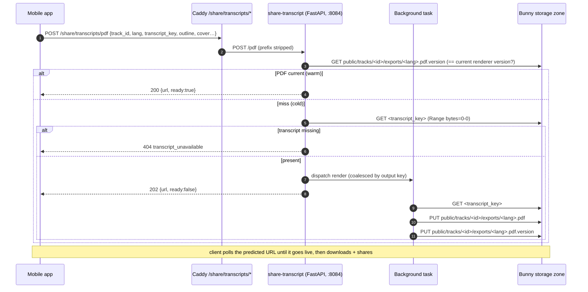
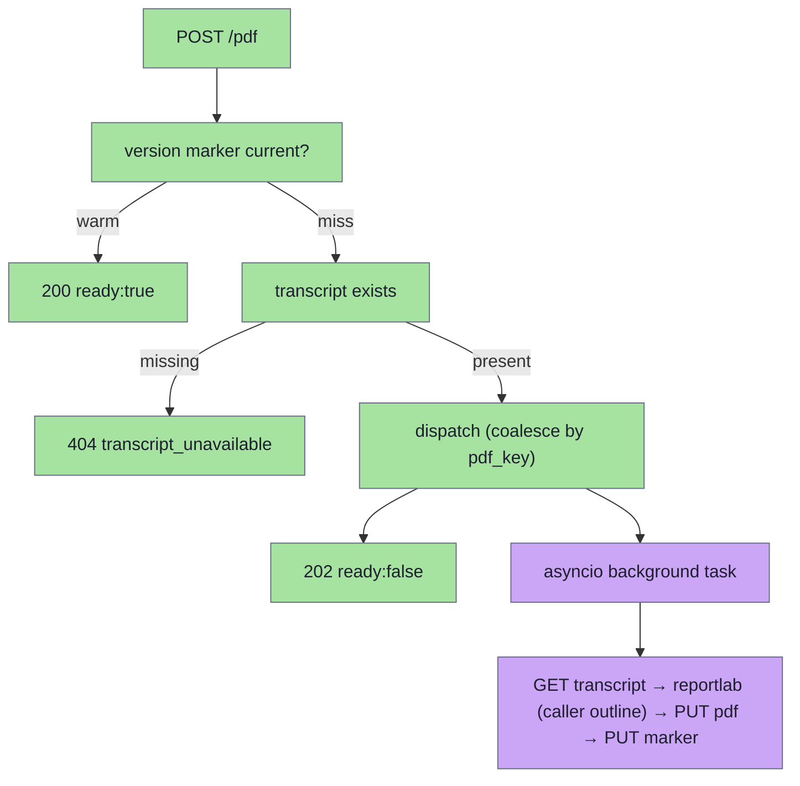
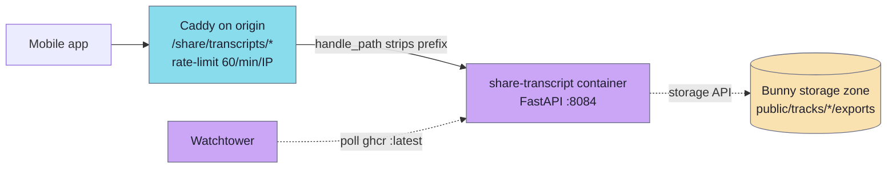

# share-transcript

A small Python/FastAPI HTTP service that renders a **printable transcript PDF** for one lecture and uploads it to the Bunny storage zone, the one write store, under `public/tracks/{trackId}/exports/{lang}.pdf`. It runs as a container in the origin app stack (`infra/app/compose`) behind Caddy at `/share/transcripts/`, alongside `share-audio` and `share-video`. A `POST /pdf` with the track's cover metadata, an optional precomputed outline, and the storage key of the transcript probes for an existing PDF of the current renderer version and — on a miss — dispatches a background render (fetch transcript → reportlab → upload) and returns the predicted public URL. The mobile app polls that URL, downloads it, and shares it like any other piece of content.

The renderer is owned by this one service, so **both** the chat share card and the Library share menu render-on-tap through it, client-initiated, without a chat turn blocking on generation. See [chat-pipeline](../architecture/chat-pipeline.md).

The service is **stateless and purely a renderer**: it never opens the catalog DB and does no domain derivation of its own. The caller (chat, which has the catalog; or the mobile app, from its local content DB) assembles the cover metadata, the lecture outline (chapter headings, used as the PDF table of contents), and the transcript storage key, and sends them all on the wire. The service only fetches the transcript JSON and renders.

## Layout

```
modules/services/share-transcript/
├── app/pyproject.toml                module shruti-share-transcript (fastapi, httpx, reportlab)
├── app/src/share_transcript/
│   ├── main.py                        FastAPI app: lifespan, /healthz, POST /pdf, CORS
│   ├── config.py                      env-driven Settings loaded once at boot; refuses to start without storage credentials + public base
│   ├── ports.py                       ObjectStore — what the pipeline needs: exists / get_text / get_json / put
│   ├── pipeline.py                    prepare_pdf: version-marker probe → 404 gate → coalesced background render (PDF, then marker)
│   ├── bunny.py                       BunnyStorage — ObjectStore over the Bunny storage API (httpx)
│   ├── meta.py                        TrackMeta/RefMeta — the wire cover metadata the caller supplies
│   └── render/                        reportlab renderer (render.py) + bundled DejaVu TTFs (fonts/)
├── app/tests/                         pytest suite (config, adapter over httpx.MockTransport, pipeline)
├── Dockerfile                         python:3.12-slim, uvicorn share_transcript.main:app on :8084
└── README.md
```

The service is wired into the stack in `infra/app/compose/docker-compose.yml` (service `share-transcript`, profile `origin`) and routed by `infra/app/compose/caddy/Caddyfile` under `handle_path /share/transcripts/*`.

## API

`GET /healthz` → `200 {"status":"ok","build":{"sha":"...","time":"..."}}`

`POST /pdf` (Caddy strips the `/share/transcripts` prefix, so the service sees `/pdf`; the format is the path segment — `/txt` etc. can be added later as sibling routes):

```json
{
  "track_id": "abc123",
  "lang": "ru",
  "transcript_key": "public/tracks/abc123/transcript.ru.json",
  "title": "…", "author_name": "…", "author_id": "…", "date": "1972-08-01",
  "location_name": "…", "location_id": "…",
  "references": [{"short_name": "ШБ", "full_name": "…", "source_id": "…", "tokens": "1.2.3"}],
  "tags": ["…"],
  "outline": [{"title": "Вступление", "start": 0, "end": 120000}]
}
```

`outline` is the precomputed lecture outline (chapter headings, `start`/`end` in milliseconds) the caller takes from the catalog; the service renders it as the PDF table of contents and as in-body section headings. Omit it (or send `[]`) for a TOC-less PDF — the service never generates an outline itself.

```json
{
  "track_id": "abc123",
  "lang": "ru",
  "url": "https://cdn.shruti.local/public/tracks/abc123/exports/ru.pdf",
  "ready": true
}
```

Status codes (same client-initiated contract as share-audio's `/excerpts`):

- **200** — warm: the PDF is already on the CDN, `ready: true`, `url` is live now.
- **202** — cold: the render was dispatched to a background task; the response carries the predicted URL with `ready: false`. The client polls the URL until the object appears.
- **400** `{"detail": {"code": "bad_track_id" | "bad_lang" | "bad_transcript_key"}}` — a value outside its shape (see below).
- **404** `{"detail": {"code": "transcript_unavailable"}}` — no transcript object at `transcript_key` (a track without a transcript in that language); checked synchronously so it fails fast rather than as a poll timeout.
- **500** `{"detail": {"code": "render_failed"}}` — synchronous dispatch error.

### Request constraints

- `track_id` matches `[A-Za-z0-9_-]{1,128}`; `lang` is a language code (`ru`, `sr-Latn`: 2–3 letters plus up to two `-` subtags, at most 16 chars); `transcript_key` is exactly `public/tracks/<track_id>/transcripts/<lang>.json`, its id segment equal to `track_id` (`keys.py`). Anything else is rejected with 400 before any storage call, so no request reaches outside `public/tracks/<id>/`.
- `lang` need not be `ru`/`en` — labels (Лектор / Дата / Содержание) fall back to English chrome for unknown codes; the transcript itself can be in any language.
- Cover fields (incl. `outline`) are all optional; the renderer degrades to an id-only cover with no TOC.
- The output key is deterministic from `(track_id, lang)`, so repeated calls reuse the same PDF (a warm probe short-circuits; concurrent cold renders are coalesced).

## Request flow



The cheap legs (warm version probe, transcript-existence probe) run synchronously before responding; the heavy legs (transcript GET, reportlab render with the caller-supplied outline, PUT) run in a background task detached from the request, so a client disconnect doesn't kill the render.

## Concurrency model



`pipeline.py` coalesces background renders by the output key (`_inflight` dict): the first cold call for a `(track_id, lang)` starts an `asyncio` task and marks the key in-flight; concurrent calls while it runs reuse the running task; the key is released on completion (via `task.add_done_callback`). This is process-local best-effort (one uvicorn worker); a cross-worker duplicate just re-renders and overwrites the same idempotent key.

## Storage and URLs

`pipeline.py` depends on the store port in `ports.py`; `bunny.py` implements it over the Bunny storage API (`{endpoint}/{zone}/{key}` with an `AccessKey` header) through one `httpx.AsyncClient` per process. It escapes every key segment on its own, refuses empty, `.` and `..` segments, and checks the final URL still lies under the zone. A `404` is "absent"; any other non-success status raises. It touches three keys per render:

- **PDF (public, write):** `public/tracks/<id>/exports/<lang>.pdf`, uploaded with `Content-Type: application/pdf`. The storage API keeps no other per-object headers, so the PDF carries no `Content-Disposition` filename (the app names the shared file itself) and its caching is the pull zone's configuration.
- **Version marker (public, read + write):** `public/tracks/<id>/exports/<lang>.pdf.version`, holding the renderer version (`PDF_RENDER_VERSION`). The storage API has no custom object metadata and the PDF key is predicted by the app, so the version lives beside the PDF. A PDF counts as present only when its marker equals the current version; the marker is written after the PDF, so a failed upload is a miss on the next call, and a layout bump re-renders in place without leaving orphans. When the marker write fails after the PDF landed, the process remembers the key and the next request for it retries only the marker, without rendering again.
- **Transcript (read-only):** `<transcript_key>`, the published transcript JSON the caller names.

The outline is supplied by the caller in the request body, so the service neither reads nor writes any outline-cache key (that cache lives on the chat side).

The returned URL is always `PDFS_PUBLIC_BASE + "/" + key`. **This URL must byte-match what the mobile client predicts from the region `urlTemplate`** (`public/tracks/<id>/exports/<lang>.pdf` under the active region), or the warm-cache probe never hits and every share cold-renders. The mirror receives the PDF and its marker through `storage-sync`.

## Configuration

| Var | Default | Notes |
|---|---|---|
| `PORT` | `8084` | HTTP listen port. |
| `STORAGE_ZONE` | required | Bunny storage zone name. |
| `STORAGE_KEY` | required | Storage-zone password. |
| `STORAGE_ENDPOINT` | the main storage host | Storage API base. |
| `PDFS_PUBLIC_BASE` | required | CDN pull-zone base for the returned URL. |
| `ENV`, `SERVICE_VERSION`, `LOG_LEVEL` | `dev`, `dev`, `info` | |
| `SHRUTI_BUILD_SHA`, `SHRUTI_BUILD_TIME` | (build args) | Stamped on `/healthz`. |

`config.load()` **fails at boot** when `STORAGE_ZONE`, `STORAGE_KEY` or `PDFS_PUBLIC_BASE` is missing, so a misconfigured host never answers with a URL that points nowhere.

## Deployment



Image `ghcr.io/jiva-studio/shruti-share-transcript:${SHRUTI_SHARE_TRANSCRIPT_TAG:-latest}`, declared in `infra/app/compose/docker-compose.yml` under the `origin` profile; a regional edge host forwards `/share/transcripts/*` to origin. It runs under the shared `app-hardening` anchor with a `curl /healthz` healthcheck and the Watchtower label. Caddy routes `/share/transcripts/*` to `share-transcript:8084` (`handle_path`, `request_body max_size 100KB`, a `share_transcript` 60/min/IP rate-limit zone, `response_header_timeout 30s`). CORS is anonymous (`*` origins, `POST`/`OPTIONS`, `Content-Type` only — no `Authorization`).

## Why Python (vs share-audio/share-video in Go)

The renderer is reportlab, so the service is Python. The deploy shape (Dockerfile/compose/Caddy/CI) mirrors the Go share-* services; only the language differs.

## Constraints worth remembering

- **Pure renderer, no catalog.** The service never reads the catalog DB and derives nothing — the caller supplies the cover metadata, the outline, and the transcript key. The service only fetches the transcript JSON and renders.
- **Cold renders are asynchronous** — a miss returns 202 + the predicted URL; the object appears once the background task uploads it. Clients tolerate the URL 404'ing briefly.
- **The PDF key is part of the client contract** — the app predicts `public/tracks/<id>/exports/<lang>.pdf` to probe for a warm copy. Bump `PDF_RENDER_VERSION` to re-render after a layout change; never move the key.
- **No JWT.** Like share-audio, the endpoint is anonymous; the key-shape checks + the Caddy per-IP rate-limit are the defence.

## Manual operations

```bash
# Health / build stamp
curl -fsS https://<host>/share/transcripts/healthz

# Smoke-test a render
curl -X POST https://<host>/share/transcripts/pdf \
  -H 'Content-Type: application/json' \
  -d '{"track_id":"<id>","lang":"ru","transcript_key":"public/tracks/<id>/transcript.ru.json","title":"Smoke"}'

# Local dev (compose)
docker compose -f infra/app/compose/docker-compose.yml \
               -f infra/app/compose/docker-compose.dev.yml \
               up --build share-transcript
```
