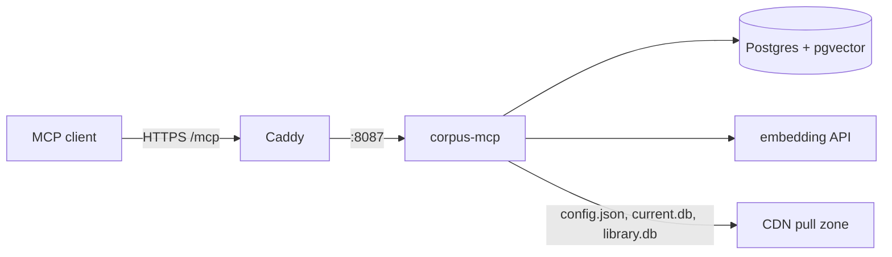

# shruti-corpus-mcp

A public, **read-only** Go MCP server over the Shruti scripture and lecture
corpus. It combines pgvector search over the chat service's own index (the
`chunks` table and `chunk_embeddings_d<dim>`) with structured reads from the two
published SQLite artifacts — the `current.db` catalog and `library.db` — which it
downloads from the CDN itself. A hit from `search` is the same chunk the chat
pipeline would retrieve, and the returned ids feed [shruti-mcp](../runbooks/shruti-mcp.md)'s
`library.attribution.*` write tools when curating [attributions](../architecture/attribution.md).
It never writes.

The service README, [`modules/services/shruti-corpus-mcp/README.md`](../../../../modules/services/shruti-corpus-mcp/README.md),
is the reference for configuration and the full tool list.

## Layout

```text
modules/services/shruti-corpus-mcp/
├── cmd/corpus-mcp/main.go     boot: config, stores, HTTP MCP (/mcp, /sse), /healthz, -healthcheck
├── internal/mcp/              tool registration, one file per tool family (tools_search.go, tools_tracks.go, …)
├── internal/application/search/  the search planner: types → lanes, reference pre-filter, fusion, enrichment
├── internal/domain/corpus/    tracks, references and chunks as the tools see them
├── internal/search/           vector, lexical and hybrid (RRF) queries; transcript windows
├── internal/embed/            query embedding (OpenAI-compatible /embeddings)
├── internal/store/ pgvector/  read-only Postgres access
├── internal/catalog/ library/ sqlitedb/   read-only SQLite access and the CDN self-bootstrap
├── internal/refs/             reference parsing ("BG 2.13", "ШБ 5.5.3")
├── internal/envelope/         {ok, kind, result} / {ok, kind, error}
└── internal/config/           env-driven configuration
```

Catalog and library reads go through [`modules/libs/catalogdb`](../../../../modules/libs/catalogdb/),
the library that owns both published formats, batched per call. The bootstrap
downloads only a catalog whose `scheme` in `config.json` equals
`catalogdb.Scheme`, and swaps a new file in under reference-counted leases: a
query that started on the old file finishes on it, and the old file closes
when its last lease is released.

## Tools

`search` · `source_get` / `source_list` / `source_resolve` · `author_list` /
`author_resolve` · `location_list` / `location_resolve` · `verse_get` /
`verse_list` · `document_get` / `document_list` · `track_get` / `track_list` ·
`transcript_window`. Clients see them as `mcp__shruti-corpus-mcp__*`.

Every tool returns the envelope; error codes are `invalid_argument`,
`not_found`, `dependency_failed` and `internal`. Without Postgres or an
embedding key, the SQLite-backed tools still serve and `search` /
`transcript_window` return `dependency_failed`.

## Deployment



Compose service `corpus-mcp` (profile `origin`, image
`shruti-corpus-mcp`). It publishes no host port: Caddy terminates TLS on the MCP
subdomain (`SHRUTI_MCP_DOMAIN`) and reverse-proxies to `:8087`. It embeds queries
with the same model and dimension as the chat indexer (`EMBED_*`, defaulting to
chat's), or query vectors land in a different space. Every tool call logs one
JSON line (tool, query, filters, count, latency, a hashed client id) to stdout.
