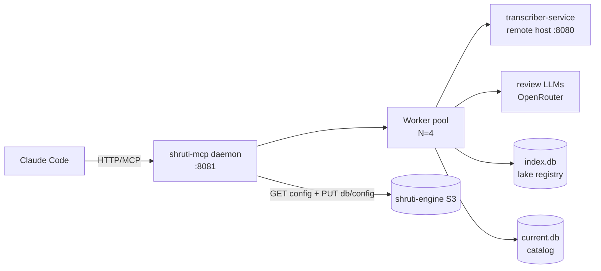

# shruti-mcp daemon

`shruti-mcp` is a long-running HTTP/SSE MCP daemon that owns the
lake-to-S3 content pipeline. One process, one TCP port, one MCP-protocol
endpoint. Claude Code connects to it via URL — it does **not** spawn the
binary as a stdio subprocess.

This runbook covers everything operational: lifecycle, logs, the async
job model, and recovery from common failure modes.



## Lifecycle

All commands run from `modules/tools/shruti-mcp/`:

| Command | What it does |
|---|---|
| `make build` | Compile `./bin/shruti-mcp` |
| `make up` | Start in background. Pid → `/tmp/shruti-mcp.pid`, log → `/tmp/shruti-mcp.log`. Idempotent (refuses if already running). |
| `make status` | Pretty-print pid + listen address, or `stopped` |
| `make restart` | `down` then `up` |
| `make down` | SIGTERM, wait 5 s, SIGKILL fallback. Drops all in-flight pipeline goroutines (state survives in `index.db`). |
| `make logs` | `tail -F` on the daemon log |

**Where the binary runs from:** `make up` `cd`'s into `RUN_DIR` (default
`$(CURDIR)` — the `shruti-mcp/` module root where the Makefile lives)
before exec, so the binary picks up `./shruti-mcp.yaml` + `./.env` from
there. Override per-invocation:

```sh
make up RUN_DIR=/path/to/some/project
```

**CLI flags** (all with defaults, can be overridden via the Makefile-injected
env or by editing the `up` target):

```
-addr 127.0.0.1:8081           # MCP listen address
-workers 4                     # file-level worker pool size
-transcribe-concurrency 2      # concurrent transcribe calls cap (M-box)
-heartbeat-interval 15s        # MCP keepalive
-config <path>                 # YAML config (default: ./shruti-mcp.yaml)
```

## Connecting Claude Code

Edit `.mcp.json` in the project where you want shruti-mcp tools:

```json
{
  "mcpServers": {
    "shruti": {
      "type": "http",
      "url": "http://127.0.0.1:8081/mcp"
    }
  }
}
```

Restart CC once after changing `.mcp.json`. Subsequent CC sessions just
reconnect to the running daemon (instant, no startup).

If you see `MCP server disconnected` mid-session: the daemon was
killed/restarted. Either wait a few seconds for CC's auto-reconnect or
trigger a tool call (it'll force a reconnect).

## Tool surface + response envelope

Tool names are dot-namespaced (`pipeline.run`, `track.audio.normalize`,
`catalog.publish`, `<dict>.resolve`, …). Every tool returns one of three
JSON envelope shapes (see `internal/mcp/envelope/envelope.go`):

```
{ "ok": true,  "kind": "<tool>", "result": <payload> }                 # sync result
{ "ok": true,  "kind": "<tool>", "run":    {id, kind, state,           # async dispatch
                                            accepted_count, rejected_count?, rejected?} }
{ "ok": false, "kind": "<tool>", "error":  {code, message, details} }  # error
```

The outer `ok` answers "did the MCP call complete" — a domain failure
(e.g. `track.commit` with missing fields) still returns `ok:true` with
the failure inside `result`; only a transport / argument fault produces
`ok:false`.

Async is **binary by tool type, not a parameter** — there is no `async`
flag. Long-running per-track tools (`track.transcript.review`,
`track.transcript.create`, `track.transcript.outline`,
`track.audio.normalize`, `track.audio.denoise`,
`track.transcript.align_pdf`) plus the fan-out tools (`pipeline.run`,
`catalog.publish`, `topics.build`, `track.topics.assign`,
`topics.covers.build`, `library.import`, `library.publish`) are async-only
and return `{run: …}`; poll via `runs.status` / `runs.wait`. Short
per-track tools (`track.status`, `track.metadata.set`,
`track.metadata.extract`, `track.audio.tag`, `track.audio.register`,
`track.topics.set`, `track.validate`, `track.commit`) and all the
deterministic dict / catalog reads stay sync and return `{result: …}`.

## Async pipeline (file ingestion → catalog commit)

`pipeline.run` returns **immediately** with a `run` dispatch (run id,
state, accepted/rejected counts); the actual work happens in the
background pool. The accepted/rejected path lists land in the run's
result payload once it finishes.

Typical flow:

```
1) pipeline.run selector={...}  →  {ok, kind:"pipeline.run", run:{id:"run_xyz",
                                     kind:"pipeline", state:"queued",
                                     accepted_count, rejected_count?}}
2) runs.status   run_id=run_xyz  →  {state, progress: {files_done, files_total,
                                       files_failed, stage_breakdown: {...}}}
3) runs.wait     run_id=run_xyz  →  blocks until terminal or timeout (default 600s)
4) runs.cancel   run_id=run_xyz  →  signals cancellation (queued runs flip
                                   immediately; in-flight stages finish)
```

Re-run a single stage on a selector with `pipeline.run op=pipeline
only=<stage>` (or a range with `from=<stage> up_to=<stage>`). `only=ingested`
is rejected — re-hashing the source mints a new track id. For batch
fan-out of post-commit operations use `pipeline.run op=<audit|...>`.

`runs.list` (defaults: state=active+recent, limit=50) shows every
in-flight run plus the most-recent terminals — same surface for
pipeline runs, catalog.publish, and the bulk per-track tools.

Per-path stage progress also surfaces via `track.status path=...` (works
both during and after a run).

**Stages** (run sequentially per file, except metadata‖transcribe in parallel
after normalize):

```
ingest  →  normalize  →  metadata ‖ transcribe  →  review  →  commit
```

### What goes where during a run

| Stage | Reads | Writes |
|---|---|---|
| `ingest` | source mp3 | `artifacts/tracks/{id}/audio/source.mp3`, `index.db.files`, stage row |
| `normalize` | source.mp3 | `public/tracks/{id}/audio/original.mp3` (128k CBR LAME) |
| `metadata` | filename + ffprobe | `artifacts/tracks/{id}/meta.json`, stage payload |
| `transcribe` | original.mp3 → M-box | `artifacts/tracks/{id}/transcripts/{lang}/raw.json` (provider-tagged, avg word-confidence per segment) |
| `review` | raw.json + review LLMs (OpenRouter, OpenAI-compatible) | `artifacts/tracks/{id}/transcripts/{lang}/{review.json,chunk_*.json}` + `public/tracks/{id}/transcripts/{lang}.json` |
| `commit` | meta + audio + transcript | `current.db` (tracks/track_variants/track_references/track_tags/tracks_search FTS), then `track.audio.tag` writes ID3 onto `original.mp3` |

`runs.list kind=pipeline` plus `runs.status run_id=…` show progress.
The daemon caps transcribe at `-transcribe-concurrency=2` system-wide
regardless of `-workers`; if a run sits with `transcribed:pending` while
M-box is idle, check `mcp__transcriber__health`.

## Async catalog publish (DB + config flip)

`catalog.publish` is a **DB-and-config flip, not an asset sweep**. It
uploads exactly two objects per S3 target: the freshly-built catalog DB
(`artifacts/catalog/current.db` → `public/db/shruti.{ver}.db`) and an
updated `public/config.json` that advertises the new version. Asset files
(audio, transcripts, images) are pushed to S3 by their own pipelines and
are never touched here. Source: `internal/application/catalog/publish/usecase.go`.

It still runs async via the unified runner — returns a `run` dispatch,
monitored via `runs.status` / `runs.wait`:

```
catalog.publish              →  {ok, kind:"catalog.publish",
                                  run:{id:"run_abc", kind:"publish",
                                       state:"queued", accepted_count:1}}
runs.status   run_id=run_abc  →  {state, progress:{files_done, files_total}}
                                 # files_total = 1 (DB broadcast) + 1 config flip per target
                              →  {state:"done", result:{version, scheme,
                                  bytes_uploaded, targets}}
```

**Step order** (so clients never see a config pointing at a missing DB):

1. Read `public/config.json` off the primary target; pick the next
   version (timestamp `YYYYMMDDhhmmss`, bumped past any existing entry).
2. Broadcast the versioned `.db` to every target (AWS primary + Yandex
   mirror).
3. Flip `config.json` on each target: prepend the new `{version, scheme}`
   entry to the `databases` array, dedupe by version, sort desc, and keep
   **every** previously-published version (a client pinned to an older
   scheme must still find a compatible DB; old blobs are pruned only by a
   separate scheme-aware retention pass, never a blind top-N). The
   locally-edited config sections — `proactive` and `regions`, owned by
   the local `artifacts/catalog/config.json` (edited via
   `catalog.proactive.*` / `catalog.config.regions.*`) — are re-shipped
   from that file when present; a section absent locally is left untouched
   on the bucket. Other top-level keys (notably `library`, owned by
   `library.publish`) round-trip untouched.
4. Update `artifacts/catalog/meta.json`: set `published_version`,
   `published_at`, and clear `modified`.

**Dry run** — compute the plan (`{version, scheme, targets, plan:[dbKey,
"public/config.json"]}`) without uploading anything:

```
catalog.publish dry_run=true
```

**Mutual exclusion:** the use case takes a shared `OpMutex` (the same
mutex `library.publish` and `catalog.refresh` use), so two publishes — or
a publish and a library publish — serialize at the use-case boundary;
never two concurrent writers to the same bucket's `config.json`.

**Heartbeat in log** — one line per step (`/tmp/shruti-mcp.log`):

```
[publish] 1/3 steps, 1.2 MB sent
[publish] 2/3 steps, 1.2 MB sent
[publish] 3/3 steps, 1.2 MB sent
```

## Recovery / common failures

### Daemon crashed mid-pipeline

On next `make up`:

1. The daemon opens `index.db` and runs `MarkInterruptedAsFailed` —
   every stage row left in `running` state from the previous process is
   flipped to `failed` so a future re-run can reclaim it (logged as
   `[recovery] flipped N running stages → failed`).
2. `runs.db` (the SQLite run registry at `artifacts/lake/runs.db`) is
   reconciled on construction: any non-terminal run row from the previous
   process is flipped to `state=failed, error="daemon restart"`. Cancel
   hooks live in memory only, so post-restart runs are guaranteed terminal
   before any cancel could fire.
3. The in-memory worker pool **queue** is empty (the channel is not
   persisted). Resubmit the same paths via `pipeline.run` —
   `runpipeline.Run` is idempotent and skips Done stages, so it picks up
   exactly where the crashed run left off.

### S3 publish failed mid-upload

Just call `catalog.publish` again. The step order holds back the
`config.json` flip until the DB is uploaded to every target, so a
mid-flight failure leaves the previous version live everywhere — a clean
retry mints the next version and re-runs the whole (small) two-object
flip. Nothing partial is ever advertised.

### M-box transcriber unreachable

`runs.status` for an in-flight pipeline run will show files piling up
in the `transcribed` slot of `progress.stage_breakdown`.
Check the upstream:

```
mcp__transcriber__health
```

`transcribe.providers.transcriber-service.endpoint` in `shruti-mcp.yaml`
must point at a reachable host. Hot-swap the endpoint without restart:

```
admin.config.set path=transcribe.providers.transcriber-service.endpoint
                 value=http://newhost:8080
```

### CC's MCP integration shows "no tools"

```sh
curl -sf -X POST http://127.0.0.1:8081/mcp \
     -H "Content-Type: application/json" \
     -d '{"jsonrpc":"2.0","id":1,"method":"initialize","params":{"protocolVersion":"2024-11-05","capabilities":{},"clientInfo":{"name":"diag","version":"0"}}}'
```

If that returns proper JSON-RPC `result.serverInfo`, the daemon is
healthy and CC just needs a reconnect (open `/mcp` slash-command in CC,
or restart the CC session).

If the curl times out or refuses connection: the daemon is down or
listening on a different port. Check `make status` and `tail
/tmp/shruti-mcp.log`.

### Ghost shruti-mcp processes

A crashed-but-not-reaped session can leave a stray daemon holding the
port. `make down` already sweeps any `pgrep -x shruti-mcp` match, but
to clean up by hand:

```sh
pgrep -fa shruti-mcp     # what's running
pkill -x  shruti-mcp     # kill by exact comm-name (won't match shell-strings)
make up                     # bring up clean
```

## Configuration sources

```
modules/tools/shruti-mcp/shruti-mcp.example.yaml   # template, DON'T edit
agent/shruti-mcp.yaml                                  # your live config
agent/.env                                                # secrets only, gitignored
```

The home directory is **not** searched. Config + secrets travel with the
project.

## Known limits

- **One publish at a time.** `catalog.publish` and `library.publish`
  share a single `OpMutex`; a second publish submitted while one is
  running serializes behind it at the use-case boundary (it does not
  fail-fast). Two parallel writers to the same bucket's `config.json`
  can't happen.
- **CC tool-call timeout caps `runs.wait`** at ~2 minutes. For a long
  batch run, `runs.wait` will time out client-side; the daemon keeps
  working. Poll `runs.status run_id=…` instead, or call `runs.wait`
  again with a fresh deadline.
- **Worker queue size** defaults to 1024 entries (`worker.New`). `Submit`
  is **non-blocking**: once the buffer is full it returns `ErrQueueFull`
  immediately rather than waiting for headroom, and `pipeline.run` folds
  those paths into the run's rejected list for later re-submission (it
  only returns `ctx.Err()` if the call is cancelled). Not a real concern
  unless someone batch-submits >1k files in a single call.

## Reference

- README: `modules/tools/shruti-mcp/README.md`
- Entry point + wiring: `modules/tools/shruti-mcp/cmd/shruti-mcp/main.go`
- Tool registration: `modules/tools/shruti-mcp/internal/mcp/tools/` (`RegisterAll` in `pipeline.go`)
- Envelope: `modules/tools/shruti-mcp/internal/mcp/envelope/envelope.go`
- Source: `modules/tools/shruti-mcp/internal/`
