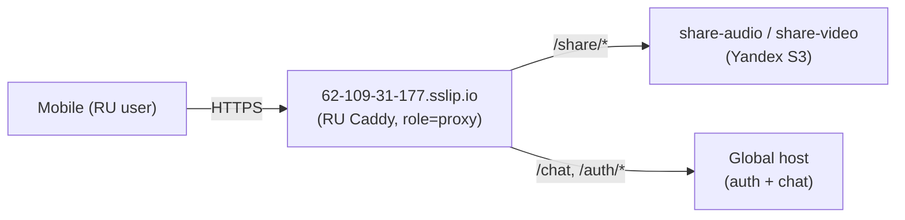

# shruti infra

Single-host stack on a VPS: postgres + redis + migrator + auth + chat +
share-audio + share-video + Caddy + Watchtower. All app images are built
by GitHub Actions (`.github/workflows/services-ghcr.yml`), pushed to
`ghcr.io/jiva-studio/shruti-*`, and pulled to the box by
Watchtower (`com.centurylinklabs.watchtower.enable=true` label).

The same compose files deploy two host **roles**, selected at deploy
time via `--role` or `SHRUTI_REGION_ROLE` in `.env`:

- `origin` — full backend (default; the global VPS).
- `proxy`  — thin RU box: only `share-audio`/`share-video` (plus a slim
  postgres for share-video's `public.tasks` queue and redis for its
  per-IP rate-limit) terminate locally. Caddy reverse-proxies `/auth/*`
  and the chat surface to the global host. See
  [RU thin-proxy architecture](#ru-thin-proxy-architecture) below.

`deploy.sh` is strictly a code/config deployer: rsync `infra/`, run
`docker compose pull && up -d`. Secrets stay on the host (`/opt/shruti/.env`,
`/opt/shruti/jwt/`) and are never copied by the script.

## Layout

```
infra/
├── compose/
│   ├── docker-compose.yml         base stack (profiles-tagged: origin/proxy)
│   ├── docker-compose.prod.yml    prod overlay (Caddy + Watchtower + socket-proxy)
│   ├── docker-compose.proxy.yml   RU-only overlay (slim postgres + caddy role=proxy)
│   ├── docker-compose.dev.yml     dev overlay (host port mappings + build:)
│   └── caddy/
│       ├── Dockerfile              custom Caddy with caddy-ratelimit plugin
│       ├── Caddyfile               TLS + rate limits + handle_path routing
│       ├── role-origin.conf        snippet: terminate /auth + chat locally
│       └── role-proxy.conf         snippet: reverse_proxy /auth + chat upstream
├── db/
│   └── migrations/                  SQL files applied by the `migrator` container
└── scripts/
    ├── deploy.sh                    rsync + docker compose up (no secrets)
    ├── bootstrap.sh                  installs docker + compose plugin on host
    ├── wipe-old.sh                   one-shot: nuke legacy /opt/shruti-chat
    ├── backup.sh                     pg_dump → S3 (cron'd on host)
    ├── gen-jwt-keys.sh               local-only: workspace JWT keypair
    └── gen-dev-env.sh                local-only: bootstraps infra/.env.dev
```

## RU thin-proxy architecture

The RU VPS runs Caddy (role=proxy) + share-audio + share-video + a slim
postgres (alpine, no pgvector — only share-video's `public.tasks` queue
lives here) + redis + migrator + watchtower. Auth + chat + cleanup-worker
are **not** on RU: Caddy reverse-proxies their paths to the global host.
Only `/share/*` and the per-host postgres/redis stay local — everything
else collapses to the single global backend.

The egress used to carry an `X-Shruti-Region: ru` tag. Its only
consumer was a PII gate in the chat service that never fired; both were
removed in #728 (see
`docs/repos/shruti/architecture/observability.md`).



Selection is by `SHRUTI_REGION_ROLE` in `/opt/shruti/.env` (or
`--role` on `deploy.sh`). The role drives which compose overlays layer
and which `COMPOSE_PROFILES` is active:

| Role     | Compose files                                                | Profiles |
| -------- | ------------------------------------------------------------ | -------- |
| `origin` | `docker-compose.yml + .prod.yml`                             | `origin` |
| `proxy`  | `docker-compose.yml + .prod.yml + .proxy.yml`                | `proxy`  |

Caddy picks its routing snippet at start via `import role-{$SHRUTI_REGION_ROLE}`
— `role-origin.conf` (terminate locally + strip inbound region header)
or `role-proxy.conf` (reverse_proxy upstream + inject region header).
Both snippet files ship inside the `shruti-caddy` image.

Proxy hosts additionally need `SHRUTI_GLOBAL_HOST=<global-domain>`
in `.env` so Caddy knows the upstream.

### JWT pubkey on RU

share-audio + share-video on RU still verify bearer tokens minted by
global's auth — RU therefore needs `/opt/shruti/jwt/public.pem`
(symlink to global's `v1.pub.pem`) mounted into the share-* containers
the same way as on origin. `deploy.sh` step 3.5 still installs every
`*.pub.pem` from `infra/app/jwt-keys/` into `/opt/shruti/jwt/`.

## Pre-deploy checklist (one-time per VPS)

The first time you stand up a server, walk through this list end-to-end.
Items marked **operator** are manual GitHub / cloud-console actions —
the scripts don't touch them.

### 1. Image registry — make ghcr packages public  *(operator)*

After the first push from CI lands the images in
`ghcr.io/jiva-studio/shruti-{auth,chat,share-audio,share-video,caddy}`,
they're created **PRIVATE** by default. Watchtower runs without
credentials, so flip each to public:

- GitHub → org `jiva-studio` → **Packages** → pick the package
- **Package settings** → **Change visibility** → Public

Repeat for each of the five packages. One-time per package.

### 2. Scoped AWS IAM users — least privilege  *(operator)*

Issue separate access keys per workload. The shared key in
`/opt/shruti/.env` (`AWS_ACCESS_KEY_ID` / `AWS_SECRET_ACCESS_KEY`)
should be scoped to the union of all four policies below — or split
per-service via separate env files if you want stricter isolation.

#### `shruti-share-audio` policy (S3 cut + upload)

```json
{
  "Version": "2012-10-17",
  "Statement": [
    {
      "Sid": "ReadSourceTracks",
      "Effect": "Allow",
      "Action": "s3:GetObject",
      "Resource": "arn:aws:s3:::shruti-engine/public/tracks/*"
    },
    {
      "Sid": "HeadAndWriteExcerpts",
      "Effect": "Allow",
      "Action": ["s3:GetObject", "s3:PutObject"],
      "Resource": "arn:aws:s3:::shruti-engine/public/shares/audio/*"
    }
  ]
}
```

#### `shruti-share-video` policy

```json
{
  "Version": "2012-10-17",
  "Statement": [
    {
      "Sid": "ReadBackgroundPacks",
      "Effect": "Allow",
      "Action": "s3:GetObject",
      "Resource": "arn:aws:s3:::shruti-engine/private/share/video/backgrounds/*"
    },
    {
      "Sid": "ReadSourceTracks",
      "Effect": "Allow",
      "Action": "s3:GetObject",
      "Resource": "arn:aws:s3:::shruti-engine/public/tracks/*"
    },
    {
      "Sid": "WriteRenders",
      "Effect": "Allow",
      "Action": ["s3:GetObject", "s3:PutObject"],
      "Resource": "arn:aws:s3:::shruti-engine/public/share/video/*"
    }
  ]
}
```

#### `shruti-chat` policy

```json
{
  "Version": "2012-10-17",
  "Statement": [
    {
      "Sid": "ReadTranscriptsAndOutlines",
      "Effect": "Allow",
      "Action": "s3:GetObject",
      "Resource": [
        "arn:aws:s3:::shruti-engine/public/tracks/*",
        "arn:aws:s3:::shruti-engine/private/outlines/*",
        "arn:aws:s3:::shruti-engine/public/library/*"
      ]
    },
    {
      "Sid": "WriteOutlineCacheAndPdfs",
      "Effect": "Allow",
      "Action": ["s3:GetObject", "s3:PutObject"],
      "Resource": [
        "arn:aws:s3:::shruti-engine/private/outlines/*",
        "arn:aws:s3:::shruti-engine/public/pdfs/*"
      ]
    }
  ]
}
```

#### `shruti-backup` policy (used by `backup.sh` cron)

```json
{
  "Version": "2012-10-17",
  "Statement": [
    {
      "Effect": "Allow",
      "Action": "s3:PutObject",
      "Resource": "arn:aws:s3:::shruti-engine/private/backups/postgres/*"
    }
  ]
}
```

### 3. S3 lifecycle policy — backup retention  *(operator)*

In the bucket settings, add a rule that deletes objects under prefix
`private/backups/postgres/` after **30 days**. Without this the backup
cron grows unbounded.

### 4. LLM spend caps  *(operator)*

Both OpenAI (Whisper for share-video, embeddings for chat) and
OpenRouter (chat agent) charge per call. Set monthly hard caps so a
leaked key can't run up an unbounded bill:

- OpenAI: <https://platform.openai.com/account/billing/limits> — set
  **monthly hard limit** ($100 is the default sane cap; raise as the
  user base grows). Configure the soft notification too.
- OpenRouter: <https://openrouter.ai/settings/credits> — load a fixed
  prepaid balance instead of auto-recharge.

### 5. ghcr pull credentials  *(operator)*

Packages on ghcr.io are kept **private**. The VPS needs a long-lived
docker login so both `docker compose pull` and Watchtower can fetch
images. We store credentials inside the project tree (under
`/opt/shruti/config/`) — not in `/root/.docker/` — so every
piece of state for one VPS lives in one directory.

1. Create a **classic** Personal Access Token at
   <https://github.com/settings/tokens/new> with **only** the
   `read:packages` scope. (Fine-grained PATs for ghcr container packages
   are still beta and don't expose an Org-level "Packages" permission;
   classic is the working path.)
2. Place it via stdin so it never lands in shell history:

   ```bash
   ssh root@<ip> 'mkdir -p /opt/shruti/config'
   echo "$GHCR_PAT" | ssh root@<ip> 'docker --config /opt/shruti/config login ghcr.io -u <github-user> --password-stdin'
   ssh root@<ip> 'chmod 600 /opt/shruti/config/config.json'
   ```

The next `deploy.sh` run reads the file via `DOCKER_CONFIG`; the
Watchtower service in the prod overlay bind-mounts it at
`/config/config.json:ro`.

### 6. Bootstrap the VPS

```bash
# SSH in and prepare directories
ssh root@<ip> 'mkdir -p /opt/shruti/jwt /opt/shruti/config && chmod 700 /opt/shruti /opt/shruti/jwt /opt/shruti/config'

# Place .env (copy infra/.env.example, fill in real values, scp)
scp infra/.env.example root@<ip>:/opt/shruti/.env
ssh root@<ip> 'chmod 600 /opt/shruti/.env && vi /opt/shruti/.env'

# Place JWT keypair (private encrypted in dotfiles, public is plain)
scp <jwt-private> root@<ip>:/opt/shruti/jwt/private.pem
scp <jwt-public>  root@<ip>:/opt/shruti/jwt/public.pem
ssh root@<ip> 'chmod 600 /opt/shruti/jwt/private.pem && chmod 644 /opt/shruti/jwt/public.pem'
```

If this VPS previously ran the legacy `/opt/shruti-chat` stack:

```bash
ssh root@<ip> 'bash -s' < infra/app/scripts/wipe-old.sh
```

### 7. Deploy

```bash
# Global (default role=origin)
SERVER_IP=<ip> ./infra/app/scripts/deploy.sh

# RU thin-proxy
SERVER_IP=<ip> ./infra/app/scripts/deploy.sh --role proxy
```

Optional overrides: `SERVER_USER` (default `root`), `SSH_KEY` (default
workspace or `~/.ssh/id_ed25519`), `--role origin|proxy` (default `origin`,
or read from `SHRUTI_REGION_ROLE` in the host's `.env`). The script:

1. Bootstraps docker if missing.
2. Verifies `.env` and JWT keys are in place — refuses to proceed otherwise.
3. rsyncs `infra/` to `/opt/shruti/infra/` (no service source code; ghcr serves images).
4. `docker compose pull` (auth, chat, share-audio, share-video, caddy from ghcr).
5. `docker compose up -d` — boots in dependency order
   (postgres → migrator → app services → caddy).
6. Health-checks `/healthz` and `/auth/healthz` over the public domain.

After #728 the project runs as a single global backend; the same
compose files serve that one host. A separate RU VPS acts as a thin
reverse proxy in front of `share-audio` / `share-video` and forwards
auth/chat traffic upstream. Its overlay and runbook are documented
separately (WS-5); this README covers only the origin stack.

### 7. Backup cron  *(operator, on the VPS)*

```bash
ssh root@<ip>
crontab -e

# add:
0 3 * * * /opt/shruti/infra/app/scripts/backup.sh >> /var/log/shruti-backup.log 2>&1
```

03:00 UTC = 06:00 MSK — typically the lowest-traffic window.

## Re-deploy

Run `SERVER_IP=<ip> ./infra/app/scripts/deploy.sh` again. Idempotent.

## Auto-updates (Watchtower)

Watchtower polls ghcr every 60s. When CI pushes a new `:latest` digest
for `shruti-{auth,chat,share-audio,share-video}`, Watchtower pulls it
on the next tick and recreates the container with the new image.
Postgres / Redis / Caddy are **NOT** Watchtower-managed (no label) —
bump those via image-tag changes in the compose files and re-deploy.

## Rollback

To pin a service to a previous image after a bad push:

```bash
ssh root@<ip>
# Find the previous :main-<sha> from ghcr or the GitHub Actions run page.
sed -i 's/^SHRUTI_AUTH_TAG=.*/SHRUTI_AUTH_TAG=main-<prev-sha>/' /opt/shruti/.env
cd /opt/shruti && docker compose -f infra/app/compose/docker-compose.yml -f infra/app/compose/docker-compose.prod.yml --env-file .env pull auth
docker compose -f infra/app/compose/docker-compose.yml -f infra/app/compose/docker-compose.prod.yml --env-file .env up -d auth
```

Watchtower will now pin to `:main-<prev-sha>` (Watchtower follows the
*tag the container references*, not literally `:latest`). When the fix
lands in `:latest`, reset:

```bash
sed -i 's/^SHRUTI_AUTH_TAG=.*/SHRUTI_AUTH_TAG=latest/' /opt/shruti/.env
# pull + up again
```

## Branch-preview deploys

`workflow_dispatch` on `.github/workflows/services-ghcr.yml` (UI: Actions
→ "Services / build images" → Run workflow) builds the chosen service(s)
from the picked branch and pushes as `:branch-<ref>`. On the VPS, set
`SHRUTI_AUTH_TAG=branch-<ref>` (etc.) and `docker compose pull && up
-d <service>`. Watchtower follows that tag from then on.

## Migrator dirty-state recovery

If a SQL migration fails mid-apply (syntax error in a freshly-landed
.sql, OOM during a large backfill, etc.), `migrator` exits non-zero and
flags `schema_migrations` as DIRTY for that version. Subsequent runs
refuse to proceed.

Recipe:

```bash
ssh root@<ip>
cd /opt/shruti
# 1. Inspect: docker compose -p shruti logs migrator
#    Identify the failing version (the log line: "Dirty database version N").
# 2. Fix the SQL on your workstation, commit, push, let CI build.
# 3. Mark the version clean on the VPS, then re-apply.
docker compose -f infra/app/compose/docker-compose.yml \
               -f infra/app/compose/docker-compose.prod.yml \
               --env-file .env \
               run --rm migrator force <N>
docker compose -f infra/app/compose/docker-compose.yml \
               -f infra/app/compose/docker-compose.prod.yml \
               --env-file .env \
               up -d migrator
```

Don't `force` blindly — first confirm the schema is in the state the
new migration expects.

## Local development

```bash
# One-time: bootstrap infra/.env.dev with a fresh random POSTGRES_PASSWORD
# (and a few placeholder vars including COMPOSE_PROFILES=origin so the
# profile-tagged services in the base compose actually start). gitignored,
# never committed.
./infra/app/scripts/gen-dev-env.sh

# Boot base + dev overlay together.
docker compose \
  -f infra/app/compose/docker-compose.yml \
  -f infra/app/compose/docker-compose.dev.yml \
  --env-file infra/app/.env.dev \
  up --build
# postgres :5432, redis :6379, chat :8080, auth :18081
# share-audio + share-video have no host ports — exercise via curl on the
# docker-internal network, or add ports to the dev overlay if you need to
# hit them directly.
```

If you re-run `gen-dev-env.sh` after already having a postgres volume,
the password no longer matches the cluster's stored role —
`docker compose down -v` to wipe + reinit, OR keep the existing
`infra/.env.dev`.

## Workspace-level secrets

The auth service needs an RSA keypair **shared across all hosts** —
otherwise tokens issued on one box wouldn't verify on another, and a
regen would force every user to re-login.

Canonical store: the `akdasa/dotfiles` repo at
`personal/projects/jiva-studio/credentials/shruti-auth-jwt-{private.key,public.pem}`.
- `*.key` is encrypted at-rest by git-crypt.
- `*.pem` (public) is plaintext — that's the point of a public key.

Workspace path `../.config/shruti/jwt/{private,public}.pem` is a pair of
symlinks into those dotfiles. `deploy.sh` and the dev compose read the
workspace path; the symlinks are created idempotently by:

```bash
./infra/app/scripts/gen-jwt-keys.sh
```

On first run (no keys in dotfiles yet) it generates them there;
on subsequent runs it just refreshes the symlinks.

### Provider OAuth IDs

Set in dotfiles `personal/projects/jiva-studio/shruti.secret`:

```
SHRUTI_GOOGLE_CLIENT_IDS=<web-id>,<ios-id>[,<android-id>]
SHRUTI_APPLE_BUNDLE_IDS=studio.jiva.shruti
```

direnv exports them on `cd shruti`. `deploy.sh` rsyncs them onto the
VPS via the .env (operator controls). The chat and share-video
containers also need them via `SHRUTI_*` → service-expected names
(see `infra/app/compose/docker-compose.yml` `environment:` blocks).
